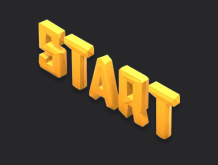

# TofuPilot Framework Starter



Minimal TofuPilot Framework procedure with a single phase.

## What's Inside

- `procedure.yaml`: procedure definition
- `phases/hello_world.py`: single Python phase
- `pyproject.toml`: uv-managed Python project

## Use This Template

Clone it from the **New Procedure** flow in TofuPilot. TofuPilot creates the repository in your account, links a procedure, builds the first deployment, and pushes it to a station.

## Structure

```
.
├── procedure.yaml
├── phases/
│   └── hello_world.py
├── pyproject.toml
└── README.md
```

## Next Steps

See the [TofuPilot guides](https://www.tofupilot.com/guides) for more templates.
